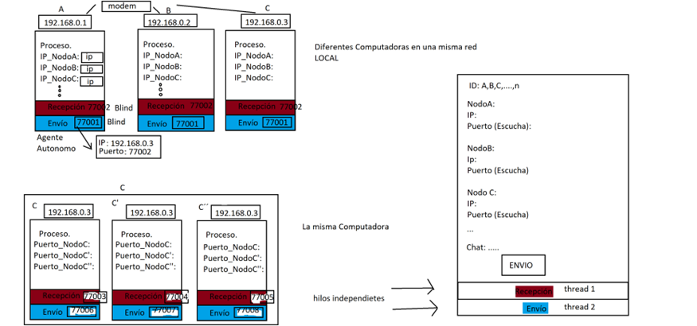

Una red peer-to-peer, red de pares, red entre iguales o red entre pares (P2P, por sus siglas en inglés) es una red de ordenadores en la que todos o algunos aspectos funcionan sin clientes, ni servidores fijos, sino con una serie de nodos que se comportan como iguales entre sí. Es más, actúan simultáneamente como clientes y servidores respecto a los demás nodos de la red. Las redes P2P permiten el intercambio directo de información, en cualquier formato, entre los ordenadores interconectados.

Cuando un cliente entra a este sistema, hace una conexión directa a uno de estos últimos, en donde recolecta y almacena toda la información y contenido disponible para compartir. Se trata entonces de un programa cuya función es la de conectar a los usuarios a través de una red sin servidores, facilitando la descarga de música, películas, libros, fotos y software, entre todos los otros usuarios y de manera gratuita. Estos archivos son compartidos “de computador a computador” por el solo hecho de tener acceso al sistema.

Normalmente este tipo de redes se implementan como redes superpuestas construidas en la capa de aplicación de redes públicas como Internet.

Dentro de esta práctica desarrollaremos un sistema distribuido de 3 nodos predefinidos. El esquema general se muestra en la imagen a continuación.

1. Considera la revisión de los siguientes recursos interactivos "Redes y protocolo Download Redes y protocolo" y "Gamificación redes y protocolos Download Gamificación redes y protocolos"  para la realización de tu actividad.

2. Desarrolla un código que permita el uso de hilos, puedes buscar ejemplos que permitan correr dos procesos independientes bajo un mismo sistema ejecutable en la web.

3. Implementa las funciones de cliente y servidor dentro del mismo proceso, puedes utilizar cualquier protocolo de comunicación (TCP/UDP), solo recuerda sus especificaciones.

4. Procura que el hilo servidor pueda recibir más de un paquete, esto se logra ciclándolo en escucha permanentemente (regularmente es un while infinito y puede que el código que copiaste ya se encuentre ciclado).

5. Crea una interfaz de usuario sencilla que te permita visualizar los paquetes enviados por otros nodos y te facilite el envío de paquetes de tu parte (como un chat). Te recomiendo que no mezcles esta interfaz con el código orientado al envío y recepción de datos, ya que este último lo seguiremos utilizando.

6. Asigna previo al envío las IPs y los Puertos por los que escuchan las contrapartes. Esto se puede hacer con vectores, dejando predefinida esta información.

7. Ejecuta el sistema tres veces modificando los parámetros de los nodos P2P. Realmente no es necesario que crees tres códigos diferentes, ya que los tres harán exactamente lo mismo, observa que lo que tienes que cambiar es simplemente a quienes debes enviar la información.

8. Envía datos y visualízalos en los otros nodos.

NOTA: Ten mucho cuidado con la asignación de puertos, ya que si no se cierran correctamente quedarán bloqueados y en posteriores ejecuciones no los podrás volver a utilizar. Te recomiendo que esto también lo agregues a la interfaz de usuario como variables para simplificarte la existencia. También recuerda que estás trabajando en tu computadora, no hemos sacado el proceso a otras computadoras en la red, por lo que realmente todos los nodos tienen la IP local.

9. Sube en este espacio tu programa ejecutable y una descripción del mismo.

10. Revisa la lista de cotejo para que consideres los criterios para el desarrollo de tu entregable.

